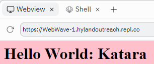
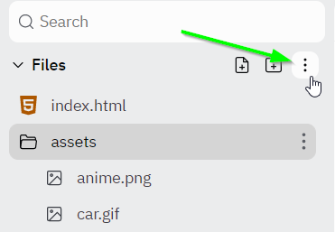
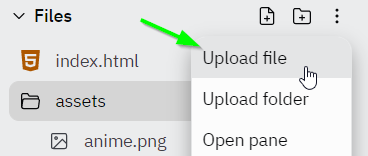
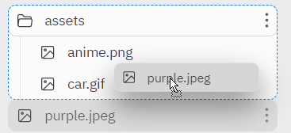
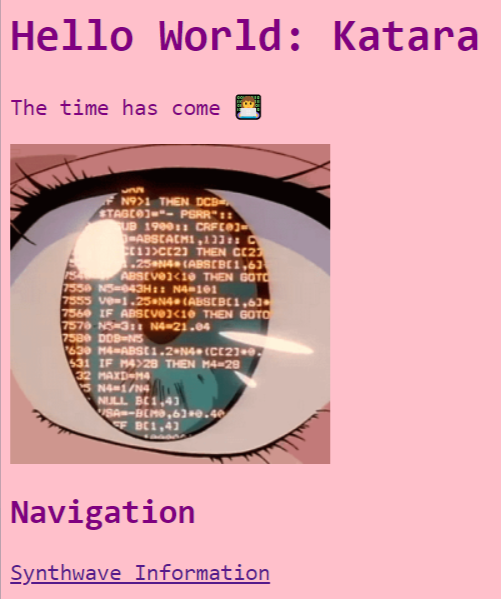
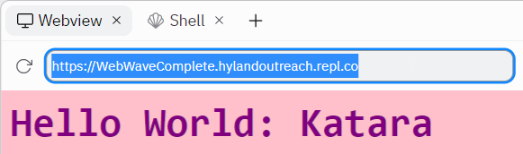

# Code-Along: Web Wave
Follow these instructions to build a hackathon website of your own 🕶

## Setup
Start by following all the steps in the [Replit Introduction](ReplitIntroduction.md) guide. Open and fork [this Repl project](https://replit.com/@HylandOutreach/WebWave) as a starting point for the code-along activity.

## Looking at the HTML
Make sure the **index.html** file is selected on the left to view the HTML code. Notice how the code in the HTML creates the text on the website. Everything in HTML goes between _tags_, which tell the website what type of element to display. There are a lot of tags right now, but the important stuff goes between the `<body>` and `</body>` tags. For example, the text between the `<h1>` and `</h1>` tags becomes a large header.

The first thing to do is update the header text with your name! For example, if my name were **Katara**, I could change the header so that it said **Hello World: Katara**.

Update the code in the HTML section, _between_ the `<h1>` and `</h1>` tags. It should look something like this:

```html
<h1>Hello World: Katara</h1>
```

Click the green "Run" button at the top:


Take a look at the **Output** section on the write - it should show your new header text!



Feel free to make the header text whatever you'd like.

## Adding a Welcome Paragraph
Now it's time to add a totally new element. The **paragraph** element is used to display normal text on a webpage. Its tags are `<p>` and `</p>`, with text content between.

1. Make a new line underneath the `<h1></h1>`
    - Still within the `<body>` and `</body>`
1. Add a `<p>` opening tag on the new line
1. Enter some text that will be displayed
    - Ex: "The time has come 👩‍💻"
1. At the end of the line, add a `</p>` to close the paragraph element
1. Run the project, and verify that the message appears on the website!

The code should look something like this:

```html
<p>The time has come 👩‍💻</p>
```

## Adding a Cool Image
Almost every website has at least one image, and yours can too! In fact, there are already a couple of images loaded into the Repl you can add to your site.

### Adding an Existing Image
The existing image can be added using the `` element. Note that this element is special; it only has an opening tag, no closing tag.

1. Make a new line under the `<p></p>`
1. Add a new element: ``
1. After the `img`, before the `>`, type in `src=""`
1. Between the double quotes, add the file path to the image: `assets/anime.png`
1. Run the project, and verify that the image appears on the website!

The code should look something like this:

```html

```

### Adding a New Image
If you want to use a picture of your own, you can add it to the Repl project!

1. Open a new tab, but make sure to keep the Repl open too
1. In the new tab, go to [google images](https://google.com/images/)
1. Search for an image you would like on your webpage (e.g., _aesthetic_)
1. Click on the image, and make sure it fully loads on the right side of the page
1. When it has loaded, right click it, and select "Save image as..."  
    
1. Enter a good name for the image (e.g., "purple.jpeg"), and save it
1. Switch back to the Replit project tab
1. In the **Files** area, click the three-dot menu  
    
1. Select the "Upload file" option  
    
1. Find the saved image, and select it
1. Click and drag the file into the **assets** folder  
    
1. Now the image can be used in your project!

The code should look the same - just update what's within the `"` and `"` after `src=` in the `` tag!

```html

```

### Resizing
The image might be gigantic - that's alright! There are several ways to update the size of an image in HTML.

1. Find the `` element in the code
1. After the `src=""`, but _before_ the `>`, make a new space
1. Add `width="200px"`
    - This sets the _width_ of the image to _200 pixels_
1. Run the project to see the image shrink or grow!
    - Feel free to update the number of pixels for different sizes

The code should look something like this:

```html

```

## Adding Another Page
The homepage for the website is looking pretty good, but we want to do more! Creating multiple HTML pages is a great way to organize all the information on a site. This is possible with a new **.html** file, and the `<a></a>` anchor element.

### Creating the New File
Start by creating a whole new **.html** file for a new webpage.

1. In the Repl **Files** area, click the "New file" button  
    
1. Enter a name for the file ending with **.html** (e.g., **synthwave.html**)  
    
1. Press `Enter` to create the file
1. The new file should open automatically in the Code Editor
1. Copy the basic HTML boiler-plate from the **index.html** file
1. Replace the `<h1></h1>` text with the word "Synthwave"
1. Replace the `img` source with `assets/car.gif`
1. Add a `<p></p>` with a quick blurb about synthwave

The **synthwave.html** file should contain text that looks something like this:

```html
<html>
  <head>
    <link href="style.css" rel="stylesheet">
  </head>
  <body>
    <h1>Synthwave</h1>
    
    <p>Synthwave (also called outrun, retrowave, or futuresynth) is an electronic music microgenre that is based predominantly on the music associated with action, science-fiction, and horror film soundtracks of the 1980s.</p>
    
  </body>
</html>
```

### Linking the New File
The Synthwave page has some good content, but there's no easy way to see it right now! We can use the `<a></a>` anchor element to create a _hyperlink_ from the homepage to the new page. An `<a></a>` element looks like this:

```html
<a href="link.html">Display Text</a>
```

- The text within the `href="` and `"` specifies the destination of the link
- The text within the `<a>` and `</a>` specifies the text that will appear for the link

Follow these steps to add a link to the **synthwave.html** file:

1. From the **Files** area, click the **index.html** file to open it
1. After the `` element, make a new line
1. Add an `<h2></h2>` element that says "Navigation"
1. Make another new line under the `<h2></h2>`
1. There, create an `<a></a>` element
1. Set the `href` to be `synthwave.html` (between `"` and `"`)
1. Set the text to be "Synthwave Information"
1. Run the project, click the link, and verify that the Synthwave page appears!

The additional code in the **index.html** file should look something like this:

```html
<h2>Navigation</h2>
<a href="synthwave.html">Synthwave Information</a>
```

### Linking Back
Now it's possible to view the Synthwave page, but there's no way to get back home! We need another `<a></a>` element in the **synthwave.html** file. We can also add a link to an _external_ website!

1. From the **Files** area, click the **synthwave.html** file to open it
1. After the `<p></p>` element, make a new line
1. There, create an `<a></a>` element
1. Set the `href` to be `index.html` (between `"` and `"`)
1. Set the text to be "Home"
1. Make another new line after that
1. Create another `<a></a>` element
1. Set the `href` to be `https://en.wikipedia.org/wiki/Synthwave/` (between `"` and `"`)
1. Set the text to be "More"
1. Run the project, click the "Synthwave Information" link, and verify that it is possible to navigate back home!

The additional code in the **synthwave.html** file should look something like this:

```html
<a href="index.html">Home</a>
<a href="https://en.wikipedia.org/wiki/Synthwave">More</a>
```

## Changing the Background Color with CSS
Now the content of the website is looking pretty good, but it's not very stylish. One way to make the website look more fun and exciting is to use CSS! HTML is like the skeleton of a webpage, just the structure, and CSS is like the clothes that it wears, giving it style.

From the **Files** area, open the **style.css** file by clicking on it. Take a look at the code so far. Try to figure out how to change the background color from `white` to another color, like `pink`!

The code should look something like this:

```css
body {
    background: pink;
}
```

Run the project, and see the background change!

## Changing More with CSS
CSS can change almost anything on a website. For this activity, update the text color, size, and font! All changes should take place in the **style.css** file.

### Updating the Text Color
Follow these instructions to change the text color on your website.

1. Find the line where the `background` color is set
1. Make a new line underneath that line (above the `}`)
1. Type in `color`, followed by a colon (`:`)
1. Make a space, and type in a new color (like `purple`) followed by a semi-colon (`;`)

Run the project, and verify that the text color changes!

Note that every CSS _property_ follows the same structure:

- Property name (e.g., `color`)
- Colon (`:`)
- Property value (e.g., `purple`)
- Semi-colon (`;`)

### Updating Font and Size
Next, update the font and size of the text by following the instructions below.

1. Make a new line under the `color` line (still above `}`)
1. Set a new property `font-family` to a value of `monospace`
    - property name, colon, property value, semi-colon
1. Make another new line, still above `}`
1. Set another new property `font-size` to a value of `18px`
    - property name, colon, property value, semi-colon

Run the project, and verify that the text changes font and size! Feel free to try changing the numbers or the font to see what works.

The code should look something like this:

```css
body {
  background: pink;
  color: purple;
  font-family: monospace;
  font-size: 18px;
}
```

## Using Custom Colors
Some basic colors are built into the web (like **pink** and **purple**), but it is also possible to use custom colors! Each color can be represented as a _hexidecimal color code_, which is a hashtag (`#`) followed by six alphanumeric characters. The easiest way to find a specific color is to use a color picker. Luckily, Replit has a color picker built right into the Code Editor! Follow the steps below to update the colors on the website.

1. Go to the **style.css** file
1. Click on the box with an existing color
1. Drag the selectors around to find a new color
1. Save the project, and verify that the new background color appears on the website!
1. Repeat the steps above to change the color of the text to another custom color

The CSS code should look something like this:

```css
body {
    background: #ffbdbd;
    color: #bf3636;
    font-family: monospace;
    font-size: 18px;
}
```

## Finishing Up
Hopefully your website is looking good by now! It should look something like this:



### Sharing
To share the published version of your website, you can copy the URL on top of the **Output** section:



Additionally, you should be able to open the website in a new tab by clicking the button in the upper right:


## Conclusion
Congratulations, you've successfully built your own website! It may seem simple so far, but these concepts form the basis of everything on the web. You can continue to fill out this website, or start a totally new site, and build from there. Make sure to check out the many resources available for further learning and exploration!

[Click here to view the Web Resources page.](WebResources.md)
