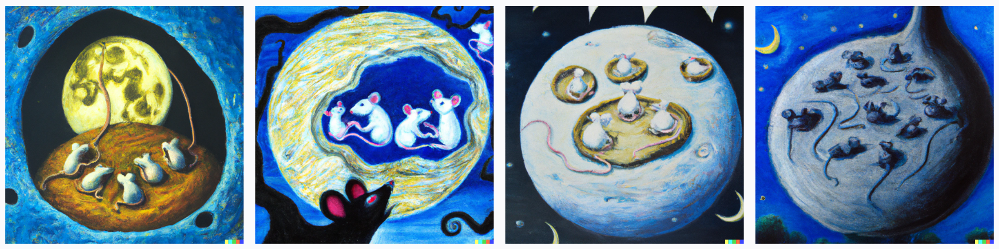

# OpenAI - Resources
Read on to learn more about the tools available to you with OpenAI!

You will need to [create an account](https://beta.openai.com/signup) with OpenAI before attempting to run any of these examples yourself.

## Links
- The [GPT-3 Playground](https://beta.openai.com/playground) is where you can interact with `GPT-3` directly.
- [DALL-E 2](https://labs.openai.com) is powered by `GPT-3` and can generate images from text and make edits to existing images.
- [ChatGPT](https://chat.openai.com/chat) is powered by `GPT-3` and can chat with you like a human (see the [blog post](https://openai.com/blog/chatgpt) to learn more).
- The [OpenAI Discord server](https://discord.gg/openai) is a thriving community where you can find examples, help from other humans, and loads of inspiration.

## GPT-3 Examples
OpenAI's [Examples page](https://beta.openai.com/examples) is a great place to start. Here are a few from that page:

- [Grammar correction](https://beta.openai.com/examples/default-grammar) corrects sentences into standard English.
  
| Prompt | Sample response |
|-|-|
| `Correct this to standard English: She no went to the market.` | `She did not go to the market.` |
| `Correct this to standard English: i wen to store but forget munny at home wont hapen again` | `I went to the store but I forgot my money at home; it won't happen again.` |

- [Summarize for a 2nd grader](https://beta.openai.com/examples/default-summarize) to translate difficult text into simpler concepts.

| Prompt | Sample response |
|-|-|
| `Summarize this for a second-grade student: In physics, the fundamental interactions, also known as fundamental forces, are the interactions that do not appear to be reducible to more basic interactions. There are four fundamental interactions known to exist:[1] the gravitational and electromagnetic interactions, which produce significant long-range forces whose effects can be seen directly in everyday life, and the strong and weak interactions, which produce forces at minuscule, subatomic distances and govern nuclear interactions. Some scientists hypothesize that a fifth force might exist, but these hypotheses remain speculative.` | `There are four special forces that affect things in our world. Gravity and electricity are two of them, and they can be seen in everyday life. The other two forces are strong and weak, and they work on very small things like atoms. Some people think there might be a fifth force, but it hasn't been discovered yet.` |

- [Create simple SQL queries](https://beta.openai.com/examples/default-sql-request) (double check these before you run them against a real database)
  
| Prompt | Sample response |
|-|-|
| `Create a SQL request to find all users who live in Ohio and have over 1000 credits:` | `SELECT * FROM users WHERE state = 'Ohio' AND credits > 1000` |
| `Create a SQL request to get me all the transactions from the past 30 days, except the ones marked as urgent, and except the ones where the buyer is from california. Buyers are in a separate table.` | `SELECT t.transaction_id, t.date, t.urgent, b.state FROM transactions t JOIN buyers b ON t.buyer_id = b.buyer_id WHERE t.date > DATE_SUB(CURDATE(), INTERVAL 30 DAY) AND t.urgent = 0 AND b.state != 'California';` |

## DALL-E 2 Examples
When crafting your prompts, be sure to take advantage of the variety of art styles available! For example, you can ask for an oil painting, digital art, 3D render, line art, a photo, or even art in the style of any known artist.

### Example prompts for image generation

- `A photo of students working together at a table in a software company. There are other tables with students in the background. The event is a hackathon.`

- `A nest of moon mice living on the moon and watching the earthrise, oil painting`

- `An ad for an iPhone from 1922, newspaper print scan`

- `A pokemon wedding cake`

