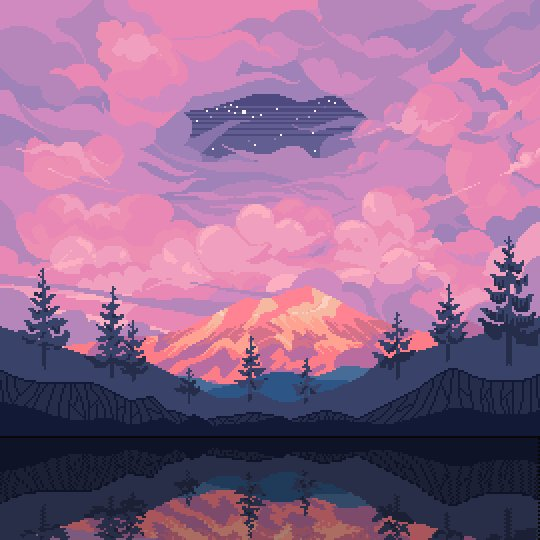
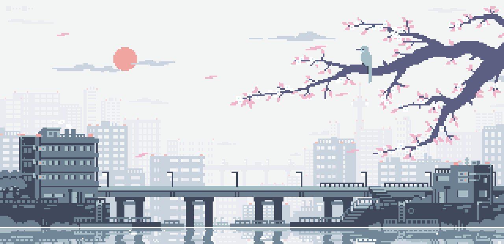

# Pixel Art Examples
This page contains some neato-cool pieces of pixel art.

## Hackathon Graphics
This graphic was created using Piskel!

## Characters
You can do a lot with pixel art characters.

## Icons
You can also use pixel art to create logos, icons, or other graphical assets for projects!

## Landscapes, Cityscapes, and More
With some practice, you can even start creating entire worlds.

## Reddit
There is a wonderful community of pixel artists on [Reddit](https://www.reddit.com/r/PixelArt/).

[Click here to view the top posts of all time.](https://www.reddit.com/r/PixelArt/top/?t=all)
