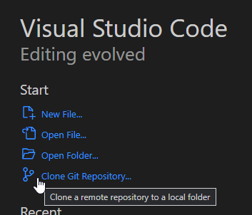
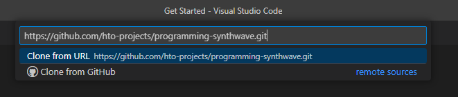

# Demonstration Guide
Follow this guide to unlock the power of extempore and start creating synthy sounds!

## Setup
There is a decent amount of setup work to be done to get [Extempore](https://extemporelang.github.io/) up and running. There is a [quickstart guide](https://extemporelang.github.io/docs/overview/quickstart/) in the Extempore docs that steps through this setup in a slightly different way.

### 1. Install Git
The starter code for this demonstration is stored in [GitHub](https://github.com/). To pull it down, you will need to have [git](https://en.wikipedia.org/wiki/Git).

[Click here to download and install git on your computer.](https://git-scm.com/)

### 2. Install & Open Visual Studio Code
To edit and run the code, you can use Visual Studio Code (VS Code). There is an extension that helps run Extempore code and get the environment working.

[Click here to download and install Visual Studio Code on your computer.](https://code.visualstudio.com/)

### 3. Clone the Code
Now we need some code to run. Open up Visual Studio Code, and click the "Clone Git Repository..." link on the welcome page.



In the box that appears, paste in the URL for the starter repository: `https://github.com/hto-projects/programming-synthwave.git`



From there, press `Enter`. Find a place for the repository folder and select it. The cloning should begin!

Once it is complete, VS Code should prompt to open the cloned repository. Open it up.

If a pop-up appears, confirm that you trust the authors of the folder:


### 4. Install the Extensions
Once the workspace is open, there are a couple of extensions to install - one totally necessary, one totally unnecessary.

On the left, select the "Extensions" menu, and find the "Recommended" area at the bottom. Install these two extensions:

- **1984** - this is a cool dark theme (just for fun)
- **Extempore** - this is the engine that runs the code


### 5. Download Extempore
There are a few different ways to download the Extempore runtime. Unfortunately, some versions may not always work perfectly. A seemingly stable release is [v0.8.7](https://github.com/digego/extempore/releases/tag/v0.8.7).

1. Go to the Extempore [Releases](https://github.com/digego/extempore/releases/) on GitHub
1. Download the appropriate version and package (e.g., **extempore-v0.8.7-windows-latest.zip** for Windows)
1. Extract the files once they are downloaded
1. Move the **extempore** folder (containing **extempore.exe**) to within the **programming-synthwave** folder

Note that it is possible to configure different locations for the **extempore** folder, but it's easiest to put it right in the workspace.

### 6. Start Extempore
Extempore should now be ready to go now! In the "Explorer" on the left, click on the **HelloWorld.xtm** file to open it.

There are a few steps to follow to start playing sounds:

1. Open the Command Palette
1. Enter the command `Extempore: Start` and press `Enter`
1. Watch it all load in the terminal
1. When it's `done`, open the Command Palette again
1. Enter the command `Extempore: Connect` and press `Enter`

Now Extempore running... it just needs some code to execute.

## Musical Hello World: C Major Scale
With Extempore running, it is possible to execute code by highlighting it and pressing `Ctrl`+`Enter`. It's time to load up some libraries and play some sounds!

1. Highlight the `(sys:load "examples/sharedsystem/setup.xtm")` line
1. Press `Ctrl`+`Enter`
1. Watch the libraries load
1. When the shared system has been loaded, highlight the `(:> scale ...)` line
1. Press `Ctrl`+`Enter` to hear the scale!
1. Execute the line below to stop the scale

Try to figure out what the code is doing, and change it up as desired. Some basics:

- Everything in Extempore is wrapped in `(` and `)` - these indicate function calls
- `:>` starts a pattern, and `:|` stops a pattern
- `scale` is the name of the pattern
- `4` and `0` indicate how long the pattern should last
- `(play syn1 @1 100 dur)` plays the `syn1` instrument, volume 100
- The `(list ...)` is the list of notes to play 

### Adding a Scale Interval
One neat possibility is to add _another_ scale, but shifted up a third.

Add this line of code:

```lisp
(:> scale-2 4 0 (play syn1 @1 100 dur) (list e4 f4 g4 a4 b4 c5 c4 d4))
```

Run both scales simultaneously by highlighting both and pressing `Ctrl`+`Enter`! Add a stop for `scale-2` as well:

```lisp
(:| scale-2 4 0 (play syn1 @1 100 dur) '())
```

Make sure to stop everything before moving onto the next step!

## Building a Base
The scale was a nice example, but let's create something a little more _scalable_. We'll start with the base: a bass. Open up the **BaseWave.xtm** file and build out a bassline and backbeat!

>Note: The two lines of code at the top of the file should not be necessary to run in this instance.

### Bass: Pattern
Run the `(:> bass ...)` statement to hear a bassline where one note repeats. Note that the statement spans multiple lines, and there is an extra piece of information for the pattern: the second `(list ...)` sets the volume of each note in the pattern.

Feel free to update the repeated note, but keep everything else the same for now!

```lisp
(:> bass 2 0
  (play syn1 @1 @2 dur)
  (list c3 c3 c3 c3)
  (list 100 95 90 75))
```

### Bass: Sound
The bass doesn't sound very bass-y yet. We can update the actual waveform to make it sound a little closer to a classic synth bass.

Run the `(set_osc ...)` statements below one-by-one to see how they change the bass sound. Sine waves are much smoother, and adding one with a `.5000` pitch adds the lower register to the output.

Feel free to update some of the numbers to see what they all do!

```lisp
(set_osc syn1 1 1.5 PARAM_SINE 1.000 0.0 0.0)
(set_osc syn1 2 .4 PARAM_SAW 1.006 0.5 0.0)
(set_osc syn1 3 1 PARAM_SINE .5000 0.0 0.0)
```

### Tempo
It is also possible to set the tempo for the pattern. Run the `(*metro* 'set-tempo 110)` line to set the tempo to **110 beats per minute**!

Feel free to update the tempo to any numeric value.

```lisp
(*metro* 'set-tempo 110)
```

### Bass: Effects
The bass sounds pretty bass-y, but there are a couple more things we can tweak:

- The Amp Envelope `(set_amp_env ...)` changes the volume as each note is played
    - In this case, it makes it a little more staccato
- The Filter `(set_filter...)` adjusts the high end and resonance
- The LFO `(set_lfo ...)` sweeps the filter up and down
- The Reverb `(set_reverb ...)` makes it sound like the sound is in a room, bouncing off the walls

Feel free to mess with any of these numbers to see what happens!

### Beat: Sampler
In addition to synthesizers, Extempore has a built-in sampler! This allows programmers to pull external sounds into the environment.

Run the `(sampler-populate-slot ...)` statements to pull in a kick drum sound and a snare drum sound. Then, run the `(:> beat ...)` pattern to perform a basic kick snare pattern!

```lisp
(:> beat 2 0
  (play samp1 @1 120 dur)
  (list *gm-kick* *gm-snare*))
```

This is synthwave though, so the drums need some reverb. Execute the next line of code to `set_reverb` on `samp1`.

### Next Steps
Now it's starting to sound like the beginning of a song. The bass and beat will return, but for now, use the last couple lines of the file to stop them.

## Refactoring
From here, it's all about making the program more extendable so we can add more layers. Open up the **Layers.xtm** file for this section.

>Note: There is a lot of code in this file that doesn't do much sound-wise, but it makes it much easier to update sounds down the line!

### Taking It from the Top: Previous Setup + Hi-Hat
The first few lines in the **Layers.xtm** file set up everything from the **BaseWave.xtm** file, with a few tweaks. The largest teak is the addition of a hi-hat cymbal. Currently, the `sampler-populate-slot` function uses **44.aif** for the hat; feel free to try another number (like **42.aif**) to see what other samples are available!

Run all the statements within the `;;; SETUP` section to play the bassline and backbeat.

#### Current State: The Need for Refactoring
The bass is working, but it's a little annoying to have to write out every single note. It makes it much more difficult to change things up, especially if we wanted to expand things. [Refactoring](https://refactoring.com/) this code will let us achieve the exact same bassline (no change in functionality), but in a way that is easier to understand and modify.

>Note: Extempore is a little odd because it uses functions and lists for pretty much everything. This style of programming may be unfamiliar to you, but it is valuable to learn!

### Bass Refactor Step 1: Define Functions
The first step is to define a few functions:

- `chord`: creates a "Chord" object, which is a `list` containing the root note and the type of chord
- `get-root`: gets the root note of a given "Chord" object
- `get-type`: gets the type of a given "Chord" object

Highlight all three of those function definitions and run them.

### Bass Refactor Step 2: Define the Progression
Here's where we actually start thinking musically. A chord progression is basically a list of chords to be played in order across a certain period of time. These chords can be whatever, as long as there are four of them! A good basic progression is:

- A Minor
- G Major
- F Major
- G Major

This is almost exactly what the bass is doing, but it goes back up to the G for the last bar. Highlight and execute the `(define progression ...)` statement to load our progression into the environment.

Feel free to change up the progression if desired!

### Bass Refactor Step 3: Playing the Bass
Now we have our progression, so we can use _that_ instead of [hard-coding](https://en.wikipedia.org/wiki/Hard_coding) the bass notes. The `prog-root` function is a helper function that should make this a little easier; it grabs the root note for a progression at a given index. Highlight and execute that function.

#### New Bass
Next, run the `bass` pattern again! Note that it calls the `prog-root` function for each note.

#### New Notes
Now, to change the notes, we just have to redefine the `progression` list! Go back up to the `(define progression ...)` statement, change it up a bit, and re-run it.

```lisp
(define progression (list
  (chord a3 "min")
  (chord g3 "maj")
  (chord f3 "maj")
  (chord e3 "maj")
))
```

### Bass Refactor Step 4: Repeats
The `prog-root` function does make it easier to change the notes, but it's still a lot of code. Luckily, there is a handy function built into Extempore that repeats code! This function is named `nof` (short for "number of repeats") and it takes a number and an expression to repeat.

Execute the next statement to update the `bass` pattern. This is basically exactly the same, just without the copied expressions - the sound should not change. Feel free to change the numbers passed to `prog-root` just to verify it is running the new pattern.

#### Updates
The real benefit of using the `nof` repeater is that it's easy to change the number of repeats! Update the code so that it runs for `16` total frames (the first number after `bass`), and that it repeats each bass note `8` times (the first number after each `nof`).

The code should now look like this:

```lisp
(:> bass 16 0
  (play syn1 @1 @2 dur)
   (list (nof 8 (prog-root 0))
         (nof 8 (prog-root 1))
         (nof 8 (prog-root 2))
         (nof 8 (prog-root 3)))
  (list (list 100 95 90 85)))
```

Highlight it and execute it to hear the lengthened duration!

## ARPing
The bass and beat are cool and good, but there's something missing. We need another layer. We could write out a melody or harmony manually, think through it all, find the perfect notes... or, we could use an automatic arpeggio (sometimes called an **arp** for short). And that's exactly what we're going to do.

### Arp Sounds
Very similar to how we set the sounds for the `bass` pattern (using `syn1`), we can set the sound for the `arp` pattern (using `syn2`). Highlight all the lines under the `;; setup arp synth` comment to load up the arp oscillators and effects.

Just to hear the arp, run the `(:> arp ...)` statement below. It only plays two notes, and they are not tied to the chord progression in any way, but they should provide an example. Feel free to change up the notes just for fun! Try adding three or six notes to the list for some polyrhythms, and make sure they fit with the bass notes.

### Chord Functions
The arp should find all the notes for the current chord, and iterate through each interval. There is a lot of code that makes this happen, but it's all worth it!

- `chord-library`: takes a chord type (like "maj") and returns a list of intervals for that chord
    - For example, the "maj" chord is the root, plus the major third, plus the fifth, plus the octave
- `shift-interval`: takes a note and returns a function that shifts the note up an interval and octave
- `arp-chord`: takes a chord (note + type), and returns a list of enumerated notes for the chord
- `prog-arp`: gets the arpeggiated note list for a chord at a given point in the progression

Don't worry if you don't understand all of these functions - just run them and get ready.

### Playing the Arp
This is where the magic happens. Run the new `(:> arp ...)` function to hear each chord in the progression sequenced on top of the bass and beat!

Note that this pattern is very similar to the `(:> bass ...)` pattern; it uses `nof` and gets the chord for the given index in the progression.

At this point, feel free to mess around with some chords or numbers to hear how everything changes! Both the bass notes _and_ the arp notes should change. That said, don't spend too long playing in this file - there is another file specifically designed for playing 😁

## Playground
Stop the patterns in the **Layers.xtm** file, and switch over to the **Playground.xtm** file. This one pulls everything from another file, **Library.xtm**, so that it can be clean and clear.

Run everything in the **Playground.xtm** file other than the pattern stops, and start messing with numbers and chords. By default, it uses this classic chord progression:

- C Major (I)
- G Major (V)
- A Minor (vi)
- F Major (IV)

There are so many great ones to try though! Just mess with everything and see what happens!

## Next Steps
Note that there are some examples within the **programming-synthwave** repository - feel free to run them, figure them out, and tweak them!

Additionally, check out these resources:
- [Synthwave Examples](SynthwaveExamples.md)
- [Extempore References](ExtemporeReferences.md)
