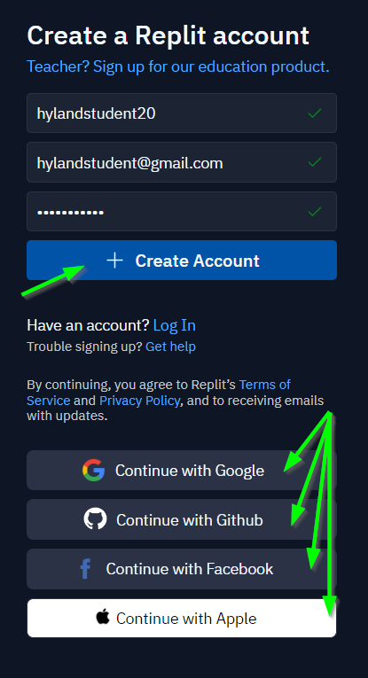
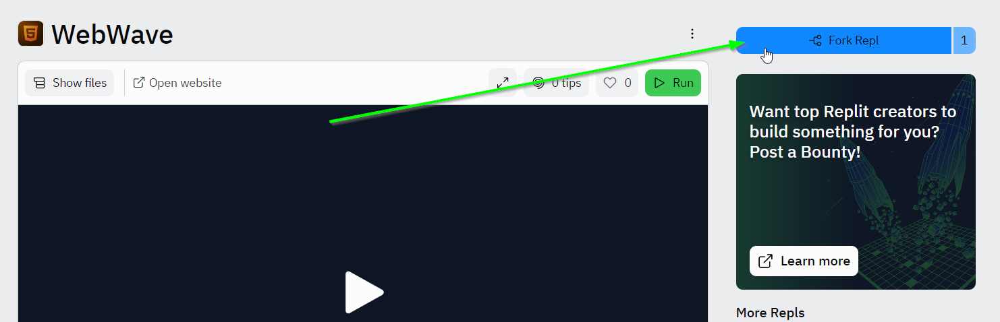
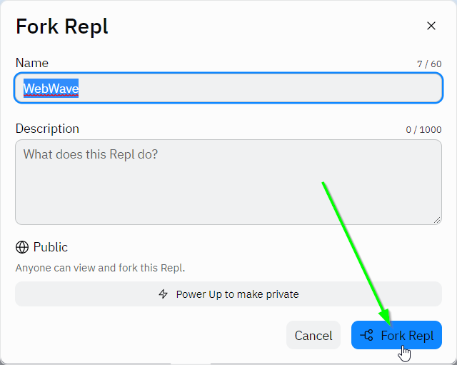
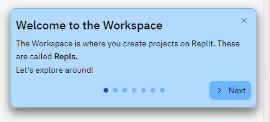
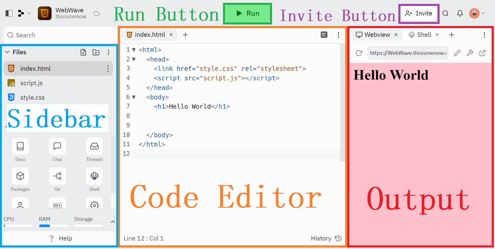
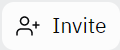
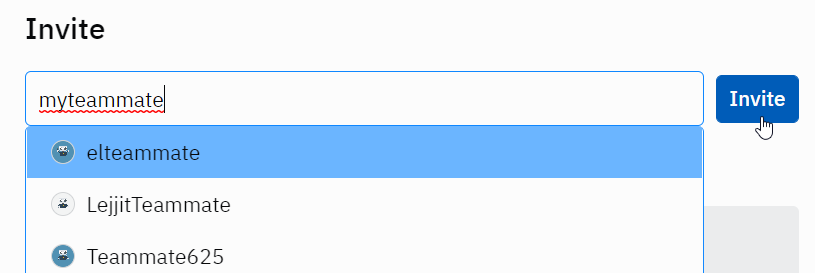
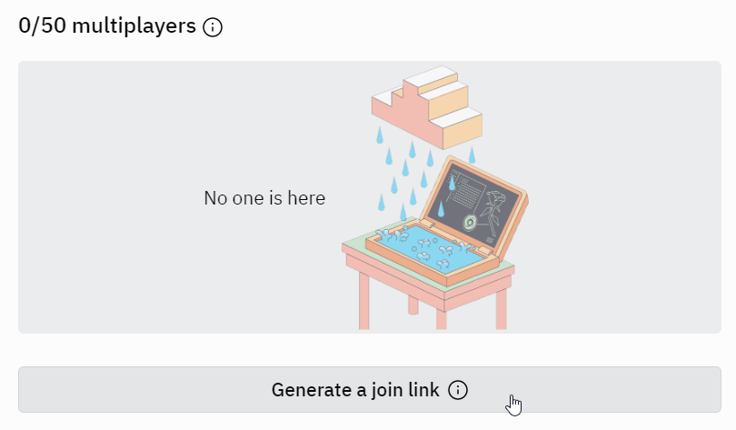
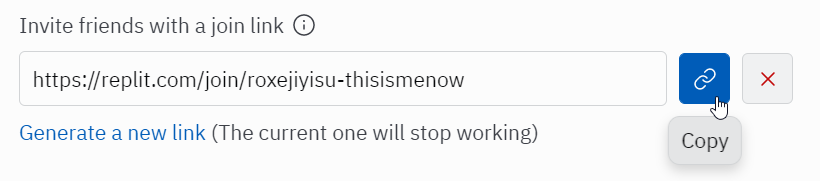
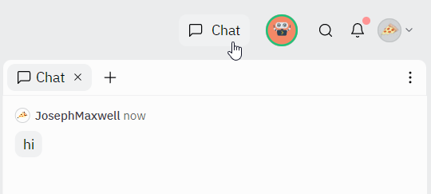

# Replit Introduction
[Replit.com](https://replit.com/) is a website that allows developers to _write_ and _run_ code right from a web browser! Create a Replit account in order to save and share code projects.

>Note: Throughout these instructions, there may be interactive Replit tutorials. Be sure to read through those helpful tips in addition to reading through this guide.

## Creating an Account
Follow the steps below to create a Repl account.

1. Go to [the Replit sign-up page](https://replit.com/signup)
1. Fill out a username, email, and password, and click the "+ Create account" button  
    - Alternatively, continue with Google, GitHub, Facebook, or Apple  
    
1. If necessary, prove your humanity to verify the account
1. Walk through the onboarding process, or skip if desired
    - Skip the coding tutorial for now

That's it! You now have a Repl account 😊

## Forking a Starter Repl Project
On Replit, you can make a lot of different things. To work on something new, you'll want to create a **Repl Project** (also simply called a **Repl**). This will be where you store all of the code for your project, be it a website, C# application, or Python script!

For the purposes of this workshop, you can **fork** an existing repl. This lets you create a copy of someone else's code, and modify it to make it your own!

1. Open the [WebWave Starter Repl Project](https://replit.com/@HylandOutreach/WebWave)
1. In the upper right, click the blue "Fork Repl" button  
    
1. In the bottom right of the pop-up, click the blue "Fork Repl" button again  
    

That's it! You now have your own Repl project 😊

## Repl Workspace Overview
If this is your first Repl project, there may be an interactive click-through tutorial explaining the basics of the Repl Workspace. Feel free to step through it; it will explain how Replit works in more detail.

Here is a quick rundown of the different areas of a Repl:

- **Code Editor**: This is where you write code. The editor helps you by giving you suggestions and coloring your code.
- **Run Button**: Tap the Run button to execute your code and see its output.
- **Output**: This is where your run output appears. This can be text, websites, games, and more depending on the template you're using.
- **Sidebar**: The sidebar contains your **Files** and **Tools** - you will have all these nifty resources at your disposal when building your projects.
- **Invite Button**: This is where you can add collaborators to your project using the **Multiplayer** feature.

In the new repl, click the "Run" button to see the code execute. It should say "Hello World" in the output area!

## Multiplayer
One of the most powerful features of Replit is **Multiplayer**. This allows multiple users to edit a Repl project simultaneously! It's kind of like Google Docs but with code. When you're working on a team, this is an easy way to collaborate.

1. In the main Repl workspace, click the "Invite" button in the upper right  
    
1. In the pop-up that appears, enter an email address or Replit username for a team member
1. Click the blue "Invite" button in the upper right
    
1. Repeat for each person on the team
1. Alternatively, click the "Generate a join link" button  
    
1. Click the "Copy" button for the link  
    
1. Share the link with your whole team

When in Multiplayer mode, you can click the "Chat" button in the upper right to chat with team members right inside the Repl!

## Conclusion
At this point you should be good to go, and ready to start developing on Replit! Make sure to remember your Replit username and password - those credentials will allow you to keep track of all your projects 😊
