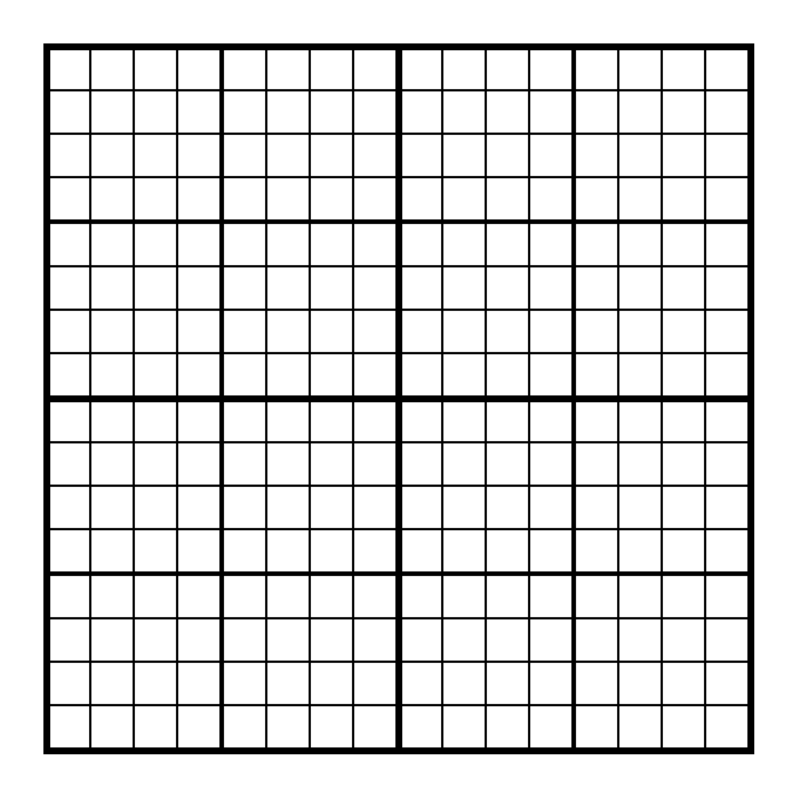
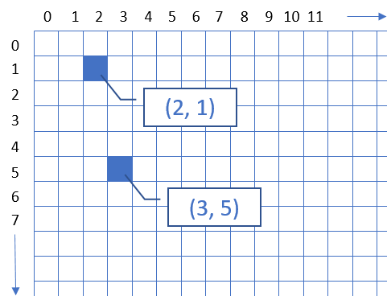

# Puzzle 3: Pixel Grid
The goal of this puzzle is to create a drawing on a pixel grid. The subject of the drawing is the answer to the puzzle! Using an online tool like [Piskel](https://www.piskelapp.com/) may be helpful, or you can try using paper!

## Instructions
The canvas for this drawing should be a `16` by `16` grid:

Each pixel has a `color` and a pair of `x` and `y` coordinates, like so: `(x, y)`.

- The `color` represents the color of the pixel
- The `x` represents the horizontal position
  - `0` on the left edge, `15` on the right edge
- The `y` represents the vertical position
  - `0` on the top edge, `15` on the bottom edge

The coordinates work like this:

Color in each pixel at the proper position on the grid to unlock the secret picture!

## Pixel List
Here is the full list of pixels:

| Green | Black | Yellow | Blue |
|-|-|-|-|
| `( 5, 0)` | `( 4, 2)` | `( 7, 2)` | `( 6, 7)` |
| `( 6, 0)` | `( 5, 2)` | `( 8, 2)` | `( 9, 7)` |
| `( 7, 0)` | `( 6, 2)` | `( 4, 3)` | `( 6, 8)` |
| `( 8, 0)` | `( 9, 2)` | `( 6, 3)` | `( 9, 8)` |
| `( 9, 0)` | `( 3, 3)` | `( 7, 3)` | `( 6, 9)` |
| `( 4, 1)` | `( 5, 3)` | `( 8, 3)` | `( 7, 9)` |
| `( 5, 1)` | `( 9, 3)` | `(10, 3)` | `( 8, 9)` |
| `( 6, 1)` | `( 3, 4)` | `(11, 3)` | `( 9, 9)` |
| `( 7, 1)` | `( 5, 4)` | `(12, 3)` | `( 5,10)` |
| `( 8, 1)` | `( 6, 4)` | `( 4, 4)` | `( 7,10)` |
| `( 9, 1)` | `(10, 4)` | `( 7, 4)` | `( 8,10)` |
| `(10, 1)` | `( 4, 5)` | `( 8, 4)` | `(10,10)` |
| `(11, 1)` | `( 9, 5)` | `( 9, 4)` | `( 5,11)` |
| `(12, 1)` | `(10, 5)` | `(11, 4)` | `( 6,11)` |
| `( 4, 7)` | `(11, 5)` | `(12, 4)` | `( 7,11)` |
| `( 5, 7)` | `(12, 5)` | `(13, 4)` | `( 8,11)` |
| `( 7, 7)` | `( 3,14)` | `( 5, 5)` | `( 9,11)` |
| `( 8, 7)` | `( 4,14)` | `( 6, 5)` | `(10,11)` |
| `(10, 7)` | `( 5,14)` | `( 7, 5)` | `( 4,12)` |
| `(11, 7)` | `(10,14)` | `( 8, 5)` | `( 5,12)` |
| `( 3, 8)` | `(11,14)` | `( 5, 6)` | `( 6,12)` |
| `( 4, 8)` | `(12,14)` | `( 6, 6)` | `( 7,12)` |
| `( 5, 8)` | `( 2,15)` | `( 7, 6)` | `( 8,12)` |
| `( 7, 8)` | `( 3,15)` | `( 8, 6)` | `( 9,12)` |
| `( 8, 8)` | `( 4,15)` | `( 9, 6)` | `(10,12)` |
| `(10, 8)` | `( 5,15)` | `(10, 6)` | `(11,12)` |
| `(11, 8)` | `(10,15)` | `( 2,10)` | `( 4,13)` |
| `(12, 8)` | `(11,15)` | `( 3,10)` | `( 5,13)` |
| `( 2, 9)` | `(12,15)` | `( 6,10)` | `( 6,13)` |
| `( 3, 9)` | `(13,15)` | `( 9,10)` | `( 9,13)` |
| `( 4, 9)` |           | `(12,10)` | `(10,13)` |
| `( 5, 9)` |           | `(13,10)` | `(11,13)` |
| `(10, 9)` |           | `( 2,11)` |           |
| `(11, 9)` |           | `( 3,11)` |           |
| `(12, 9)` |           | `( 4,11)` |           |
| `(13, 9)` |           | `(11,11)` |           |
| `( 4,10)` |           | `(12,11)` |           |
| `(11,10)` |           | `(13,11)` |           |
|           |           | `( 2,12)` |           |
|           |           | `( 3,12)` |           |
|           |           | `(12,12)` |           |
|           |           | `(13,12)` |           |
| . | . | . | . |
