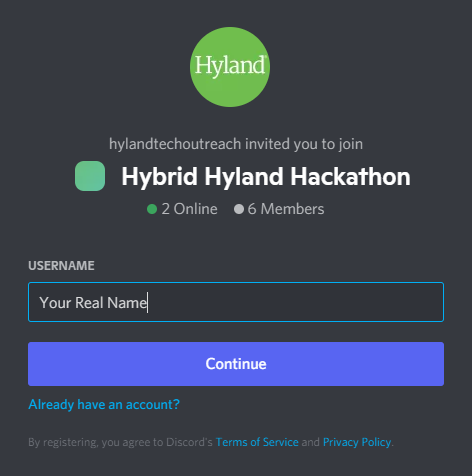
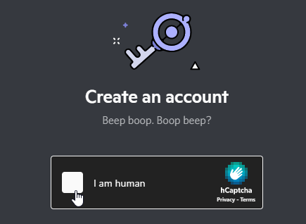
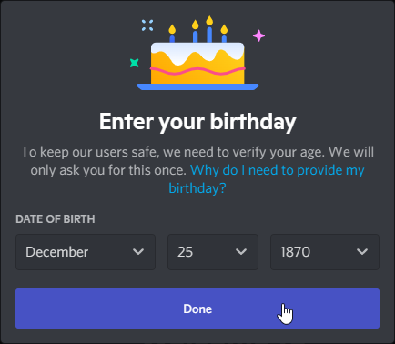
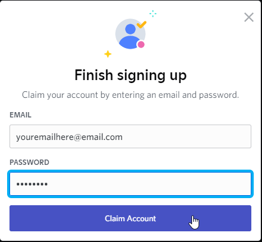
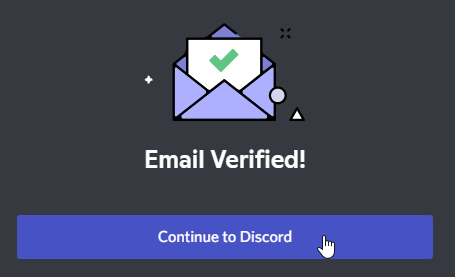

# Discord Information
_Communication is key._

We will use [Discord](https://discord.com/) as a way for students and mentors to communicate during the event.

## Invite Link
[Click here to join the Discord Server.](https://discord.gg/ah6678uzWA)

## Parental Consent Form Agreement 
As noted in the parental consent form that was signed by Parents or Guardians, each student has agreed to the following regarding the use of Discord: 

>I agree and understand that Hyland may provide for the use of certain unaffiliated third party websites or applications (“Third Party Sites”) in connection with the Program. I understand that use of these Third Party Sites is optional. If I choose to permit my child(ren) to use such Third Party Sites, I further understand and agree that: (i) the Third Party Site may collect personal information directly from my child(ren) subject to the terms and conditions (including an applicable privacy policy) available on the Third Party Site; and (ii) Hyland does not control these Third Party Sites and is not responsible for their information collection practices.

## Additional Guidelines
- The usage of Discord is **not** required
    - If you do not want to use it, you will still be able to participate in the Hackathon
- You must use your _real first and last name_ when communicating on Discord
    - If we see an account that does not have a real student name, the account will be kicked out
    - Follow [these instructions](https://support.discord.com/hc/en-us/articles/219070107-Server-Nicknames) to update your Server Nickname
- If you say anything inappropriate, you will be banned from the server and may be removed from the event
- Please be respectful of all attendees and mentors while communicating on Discord
- [Mentors](DuringTheEvent/Mentors.md) will check Discord frequently, so feel free to post any time
    - Tag the `@mentors` role to reach them

Review the information below if you need help getting into Discord for the first time, or you want to learn about the operation and structure of the Hackathon server.

## Setup
To use Discord, you must first set it up. Start by clicking the invite link, and then follow the steps below.

**Enter your _real full name_ and click the "Continue" button to create an account.**  

>Note that if you already have an account, you can use it, but be sure to [change your nickname](https://support.discord.com/hc/en-us/articles/219070107-Server-Nicknames) to your real full name.

**Next, complete the Captcha if necessary.**

**On the next screen, enter your birthday.** Note that you will not be able to use Discord if you are under 13 years of age.  

**On the next pop-up, enter an e-mail and password.** Be sure to remember your password.

An email verification message should appear.  

**Open your email account, and there should be a new message from Discord. Open the message, and click the "Verify Email" button.**  

Clicking the button should open a webpage. There should be an "Email Verified" message. **Click the "Continue to Discord" button to continue.**  

 

## Server Categories & Channels
There are several channels in the server. Please be mindful of each channel's purpose.

### PREP CHANNELS
These channels are meant to be used before the event begins.

#### welcome
Say hi in this channel!

#### find-a-team
Use this channel to find a team! Feel free to post your name, school, grade level, and coding experience. Then, try to find other attendees who would make good teammates.

#### prep-questions
Use this channel to ask questions about the logistics of the event, before it begins.

### EVENT CHANNELS
These channels are meant to be used during the event.

#### announcements
The event coordinators will post event announcements in this channel - keep your eyes peeled for important information.

#### general
This channel is reserved for general chat. Get to know your fellow participants, and discuss your Hackathon experience!

#### questions
Have a question about the event, or about your project development? Post it here, and event coordinators, mentors, and fellow participants might be able to help you out.

### DIVISION CHANNELS
These channels are specific to each individual student. You'll only have access to the channels that apply to you.

#### in-person
This channel is for students attending the event **in-person** at Hyland HQ.

#### virtual
This channel is for students attending the event **virtually**.

#### explorer
In this channel, students following the **explorer** track can chat with each other.

#### artisan
In this channel, students following the **artisan** track can chat with each other.

#### scientist
In this channel, students following the **scientist** track can chat with each other.

#### high-school
This channel is for all the high school students attending the event.

#### college
This channel is for all the college students attending the event.

### OFF TOPIC CHANNELS
These channels are strictly for fun!

#### counting
This channel is for counting. Post sequential whole numbers, and do not post two numbers in a row.

#### counting-discussion
Discuss the happenings of the `#counting` channel.

### TEAM CHANNELS
Once teams are formed, the Team Channels category will include channels for each individual team (if necessary). These will be especially helpful for virtual attendees. Let us know if you need us to create a Voice channel for you!
