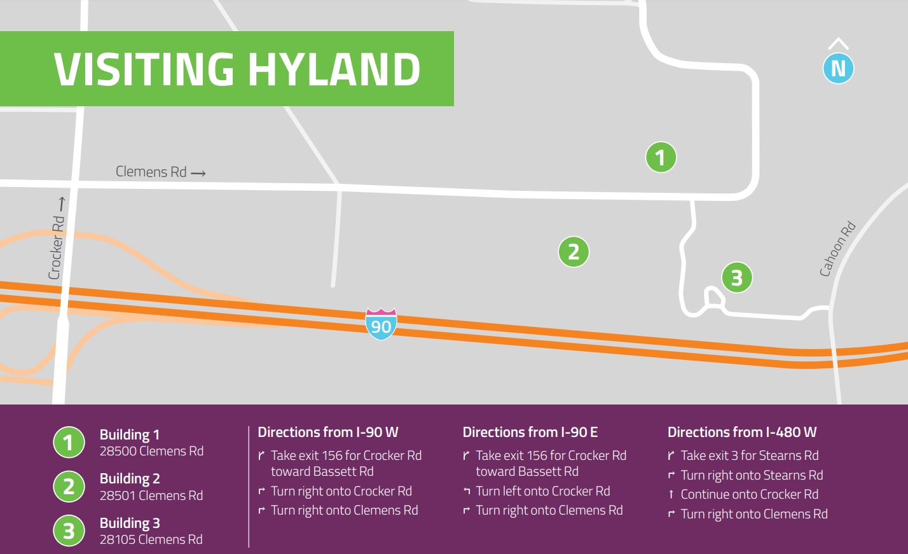
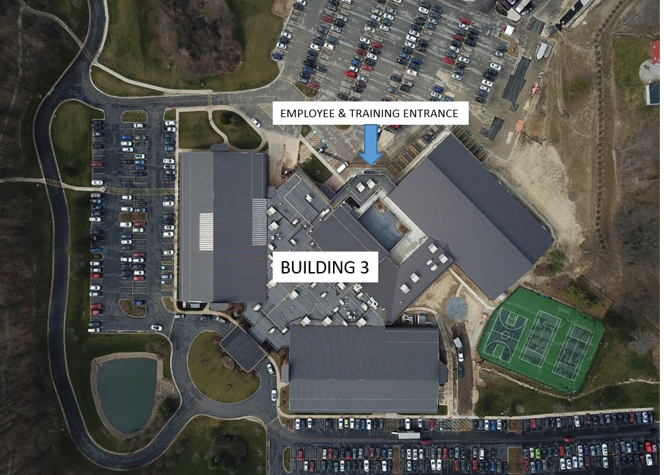

# In-Person Information
This page contains some basic information for the event for in-person attendees.

## What to Bring
Here are some things we recommend packing.

- A computer (laptop or desktop) and charger
- A cell phone and charger
- Headphones
- Post-it notes, dry-erase markers, pens, notebooks
- A gaming console or other leisure-time activities (playing cards, etc)
- Your own food if you have dietary restrictions - there are fridges and microwaves available
- A water bottle
- A sweatshirt - it can get chilly in the office!
- A sleeping bag
- An air mattress or yoga mat - couch access will be limited
- A pillow
- A blanket
- Slippers
- A change of clothes - remember, you'll have to present to the judges
- A towel, soap, and shower shoes if you plan on showering
- Deodorant
- Toothbrush & toothpaste

This is by no means an exhaustive list; feel free to bring whatever you need to make sure you are comfortable!

## Location & Directions
The in-person event will take place at Hyland's Building 3: [28105 Clemens Rd, Westlake, OH 44145](https://goo.gl/maps/FgcuhNcyzFZZTqWd8)

## Hyland Building 3 Entrance
Please enter through the Employee & Training Entrance on the North side of Building 3.

## Hyland Building 3 Interior Map
Activities and Workstations will be located on the 1st floor, in the core of Building 3.

## Wi-Fi
Connect to the **Hackathon** Wi-Fi network, and enter the following credentials:

- Password: **HylandSoftware!**
  - _Note that the Password is case-sensitive_

## Coming & Going
You are welcome to leave Hyland and return as you wish.

- Enter and Exit from the Employee & Training Entrance.
- Make sure you sign in/out with a mentor's sign-off.
- Do NOT leave without ensuring that the mentors are aware.
- You can find a mentor at the Mentor's Room or by tagging `@mentors` on [Discord](DiscordInformation.md).
  - You can also contact a member of the Tech Outreach Team.
- **If you leave for the night on Saturday, be sure to return by 9AM ET on Sunday for the Day 2 Kick-Off.**

## Rules
Please follow all the rules of the event, or you may be removed and banned from attending future events.

- Participants will stay on the first floor in the core of Building 3 throughout the event. They will not access or utilize parts of the building that are off limits to event attendees.
- The Auditorium will be reserved as a quiet area when it is not being used for other activities.
- ONLY enter and exit through the Employee & Training Entrance throughout the weekend.
- Bathrooms and showers can be used.
- No alcohol is allowed on premises, and no intoxicated participants will be allowed to enter the building.